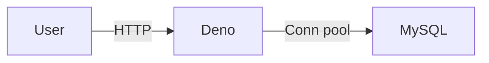

# Description

Hierarchy service



## API

### GET /ping

just ping :) always returns ok and status 200

#### GET /ping: Response

```json
"ok"
```

### POST /employees

Rewrites current employees hiearchy.

#### POST /employees: Request

Json shema for request:

```json
{
 "$schema": "http://json-schema.org/draft-07/schema#",
 "type": "object",
 "patternProperties": {
  ".*": { "type": "string" },
 },
 "additionalProperties": false,
}
```

Example:

```json
{
    "Pete": "Nick",
    "Barbara": "Nick",
    "Nick": "Sophie",
    "Sophie": "Jonas"
}
```

#### POST /employees: Response

Document representing unflattened hierarchy.

```json
{"Jonas":{"Sophie":{"Nick":{"Pete":{},"Barbara":{}}}}}
```

### GET /supervisors/:name/:levels

Returns supervisors of :name up to :levels in height.

#### GET /supervisors/:name/:levels: Request

Params:

- name – case sensitive name of employee;
- levels – integer specifying depth of search.

#### GET /supervisors/:name/:levels: Response

An unsorted array of supervisors names for :name.
Empty array if :name does not exists or has no supervisors.

Example:

```json
[ { "name": "Sophie" }, { "name": "Jonas" } ]
```

## How to setup local dev environment

Copy config `cp .env.dist .env`

VsCode:

1. Reopen in container
2. Deno: cache depenencies

App is started in watch mode. Logs are in VsCode Terminal.

Some app setting are set in devcontainer.json.

### Debugging

To start debugging session use Attach to remote.
If you need to debug bootstrap, kill terminal process and start with `denon run --allow-all --inspect-brk=127.0.0.1:9229 main.ts` then 'Attach to remote'.

### Workflow

#### lint and format

`deno lint`

`deno fmt`

#### running tests

`deno test --allow-read`

to watch tests:

`denon test`

#### upladting snapshots

`deno test --allow-all -- --update`

## How to deploy

`docker build -t deno-container`

`helm install deno ./deno-chart`

Port fowarding of app container:

```bash
export POD_NAME=$(kubectl get pods --namespace default -l "app.kubernetes.io/name=deno-chart,app.kubernetes.io/instance=deno" -o jsonpath="{.items[0].metadata.name}")
export CONTAINER_PORT=$(kubectl get pod --namespace default $POD_NAME -o jsonpath="{.spec.containers[0].ports[0].containerPort}")
echo "Visit http://127.0.0.1:8081/ping to use your application"
kubectl --namespace default port-forward $POD_NAME 8081:$CONTAINER_PORT
```

## Test requests

located in test.http file. Supported by [rest-client](https://marketplace.visualstudio.com/items?itemName=humao.rest-client) vscode extension

## Features

- [✅] parse payload, transform
- [✅] store payload in mysql/maria
- [✅] hande syntax errors in payload as 400 json excpetion
- [✅] endopoint for supervisor from storage
- [✅] devcontainer, readme.md
- [✅] tests !
- [✅] basic auth !!
- [✅] helm for mysql and service !!!
- [✅] todo service to mysql connection in k8s !!!!
- [✅] move secrets from deployment to separate file that could be encrypted with sops
- [✅] read sql from file
- [] devcontainer with kind, helm. support for debugger into k8s attachment
- [✅] healthcheck handler
